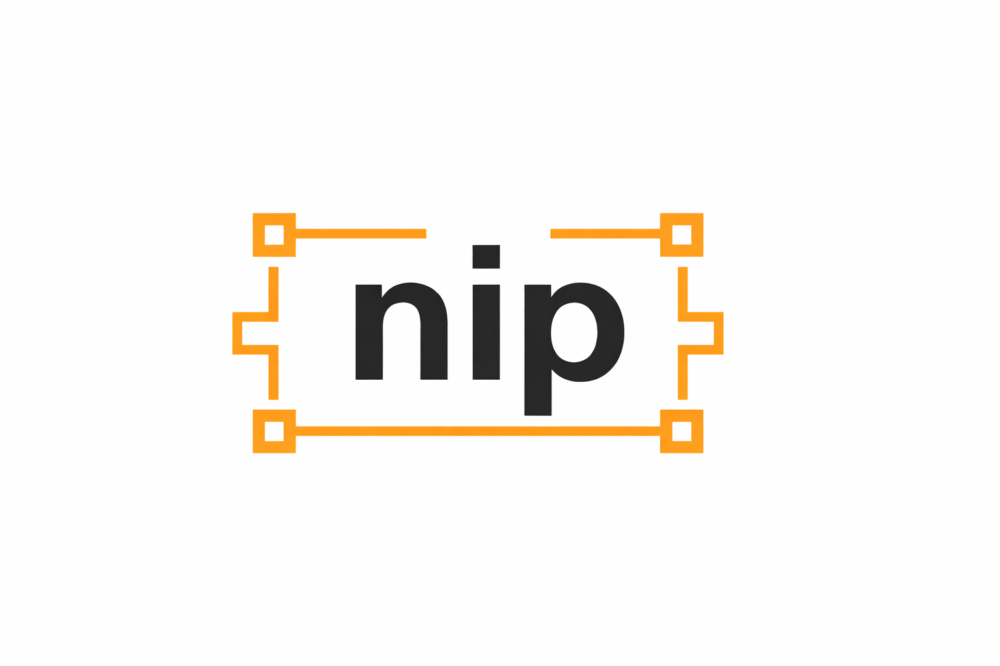

<p align="center">

</p>
</div>
<p align="center">
Minimal • Fast • Pythonic Chatbot API
</p>

<p align="center">


</p>

---

## About nip

**nip** is a lightweight chatbot backend built with FastAPI.

It provides a clean and minimal architecture for building conversational systems, AI chat services, and modern API backends using Python.

The project focuses on simplicity, modularity, and strong typing, making it easy to extend and maintain.

---

## Philosophy

nip follows a simple philosophy:

* minimal architecture
* explicit code
* strong typing
* modular services
* predictable structure

Instead of hiding logic behind layers of abstraction, nip encourages clear separation of responsibilities.

---

## Features

* Lightweight chatbot backend
* Clean modular architecture
* Strong typing with request validation
* Automatic API documentation
* High performance asynchronous API
* Easy integration with AI models and external APIs

Thanks to FastAPI, nip also includes automatic interactive documentation powered by Swagger UI.

---

```

This separation keeps responsibilities clear:

| Layer    | Responsibility             |
| -------- | -------------------------- |
| api      | HTTP endpoints             |
| models   | request / response schemas |
| services | business logic             |
| core     | configuration              |

## Installation

Clone the repository:

```
git clone https://github.com/YGG-dr/nip.git
cd nip
```

Install dependencies:

```
pip install -r requirements.txt
```

---

## Running the Server

Start the development server:

```
uvicorn app.main:app --reload
```

The API will be available at:

```
http://127.0.0.1:8000
```

---

## API Documentation

Interactive documentation is automatically generated.

Swagger UI:

```
http://127.0.0.1:8000/docs
```

Alternative documentation:

```
http://127.0.0.1:8000/redoc
```

---

## Example Endpoint

Example route:

```python
from fastapi import APIRouter

router = APIRouter()

@router.get("/")
def root():
    return {"message": "nip is running"}
```

Example response:

```
{
  "message": "nip is running"
}
```

---

## Example Chat Request

Endpoint:

```
POST /chat
```

Request body:

```
{
  "message": "hello"
}
```

Example response:

```
{
  "response": "Hello! How can I help you?"
}
```

---

## Use Cases

nip is well suited for:

* AI chatbot backends
* conversational APIs
* microservices
* internal automation tools
* AI assistants
* experimentation with LLM systems

---

## Contributing

Contributions are welcome.

1. Fork the repository
2. Create a feature branch
3. Submit a pull request

Please keep contributions aligned with the philosophy of **simplicity and clarity**.

---

## Security

If you discover a security issue, please open an issue in the repository.

---

## License

nip is open-source software released under the **MIT License**
